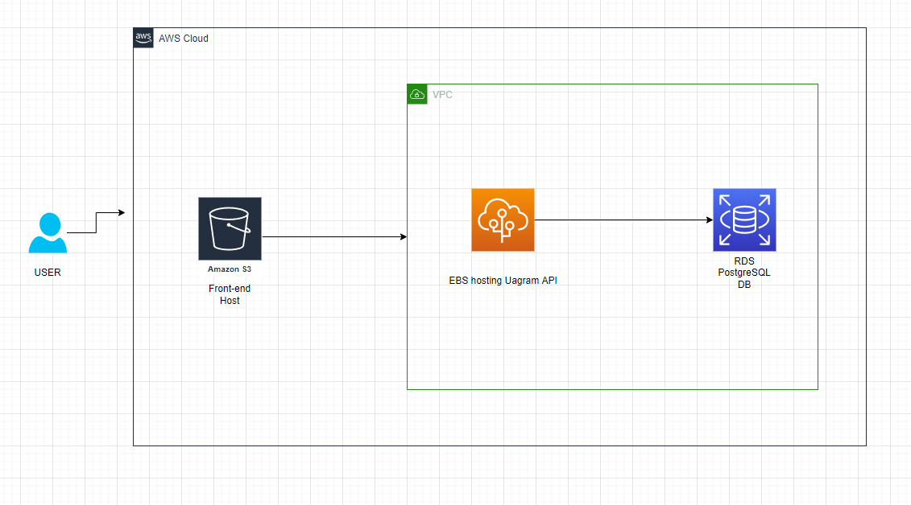

# Project Infrastructure

Udagram is a full stack app built using Angular/Ionic in the front-end hosted in an S3 bucket and a back-end API using Express/Node.js and hosted on Elastic Beanstalk by AWS. The database is a PostgreSQL db hosted on RDS.

## AWS Cloud Setup

### S3 Bucket

The frontend application is deployed using AWS S3 Bucket. The bucket is publicly accessible.

- S3 Endpoint: <http://mmn-udagram.s3-website-us-east-1.amazonaws.com>

Users can access the application from the Bucket URL.

### RDS Database

The application server uses AWS RDS Postgres for the database.

- RDS Host: <http://database-1.c1kobdvxkexq.us-east-1.rds.amazonaws.com>
- RDS Port: 5432
- RDS Name: postgres

### Elastic Beanstalk

The application API is deployed on AWS EBS. The API files are uploaded to an S3 bucket while EBS runs the application.

- EBS URL : <http://udagram-api-dev3.eba-puwdme8y.us-east-1.elasticbeanstalk.com>

# Environment Variables

Setup your .env file (for local hosting) or the cloud environment variables with the following variables

- POSTGRES_HOST={Your_Postgres_Host}
- DB_PORT={Your_DB_PORT}
- PORT={API_PORT}
- POSTGRES_PASSWORD={YOUR_POSTGRES_PASSWORD}
- POSTGRES_USERNAME={YOUR_POSTGRES_USERNAME}
- POSTGRES_DB={YOUR_POSTGRES_DB}
- RDS_DIALECT=postgres
- AWS_REGION={AWS_REGION}
- AWS_PROFILE={AWS_USER_PROFILE}
- AWS_BUCKET={AWS_S3_BUCKET_NAME}
- URL={AWS_S3_BUCKET_URL}
- AWS_ACCESS_KEY_ID={AWS_USER_ACCESS_KEY}
- AWS_SECRET_ACCESS_KEY={AWS_USER_SECRET_KEY}
- JWT_SECRET={YOUR_JWT_SECRET}
